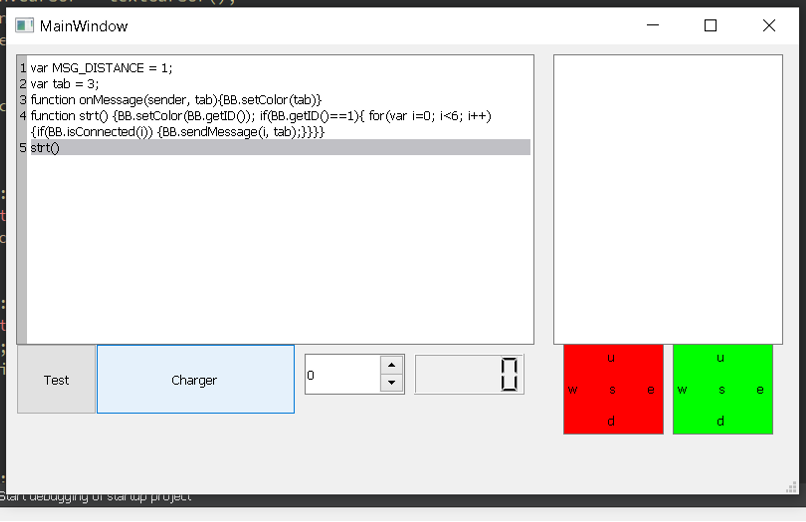
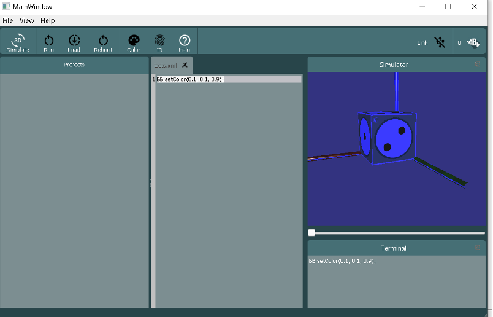
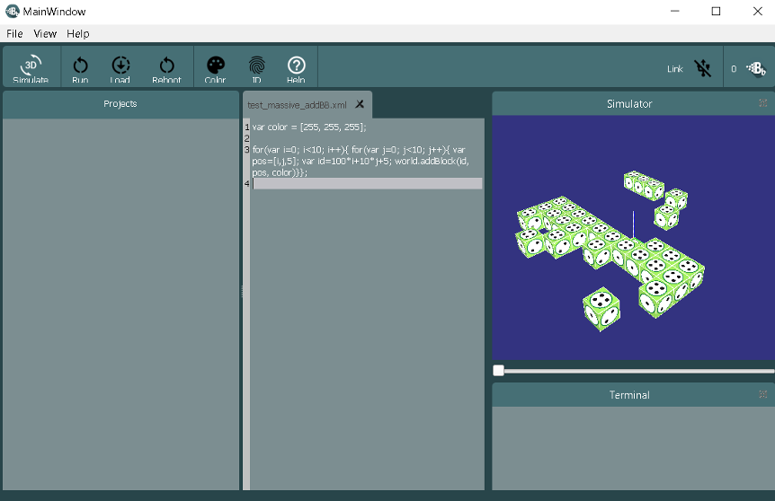
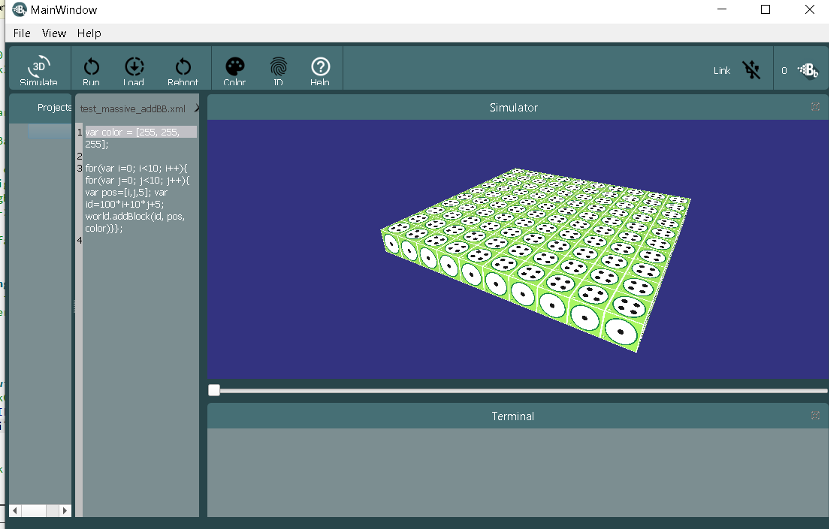
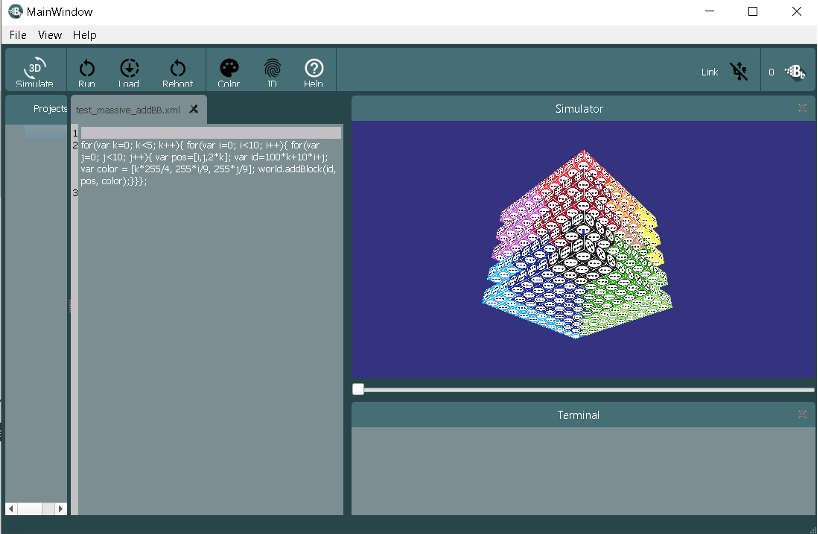
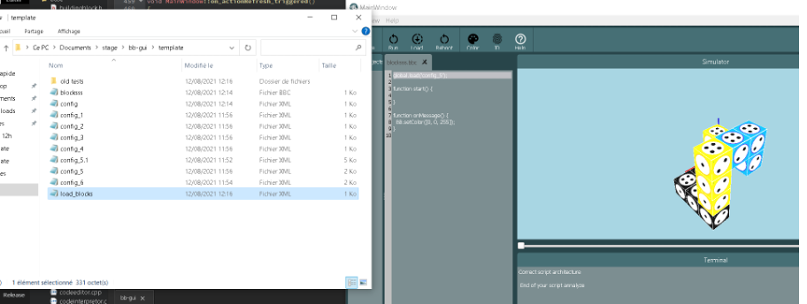
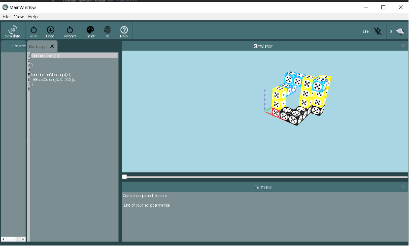

# First Year Traineeship
## Computer development of a code interpreter for a modular robotics simulator
This summer (2020), I had the chance to work with a FEMTO ST's team. I learnt lots of things about team development, C++ language used with the Qt library and the professional world. That's why I want to thank Benoît Piranda, Rémy Tribhout and Julien Bourgeois to let me integer their team. My work was structured about the development of a code interpreter software for BlinkyBlocks, one of their main project. This interpreter was supposed to be used in a 3D simulator to simulate these BlinkyBlocks. For this aim, I used the Qt library based on C++. First I realized a small application in order to familiarize with Qt and to develop my skills in C++. Thus I simulate two BlinkyBlocks with their oriented faces and my job was to change their color or to change datas in templates of Qt using a small code interpreter that I made. You can find here a photo of the interface I made just bellow:

Then, my job was to create the interface and then the code interpreter linked to a 3D simulator created by Benoît Piranda in order to add some blocks in the simulator, change the color of blocks etc... However, lots of problems concerning the ram memory and the simulator led me to such a result:

That’s why I spent all my time for a week to fix these problems and the global architecture of the software to the actual architecture, adding in the same time some of doc and commentary in my code. Thanks to that, I fixed the memory problem that is really visible on these screenshots (before the fix on the left and after the fix on the right):

Then I changed the coloring system of the app in order to create lots of blocks with different colors depending on the position of the blocks:

Last but not least, I had to introduce a communicating system during my 2 last weeks. Thanks to this system, robots can communicate to their neighbors some messages, concerning a certain Id or a general information. This system was made to simulate a real system of robots because all these physical BlinkyBlocks have an Id but the code (in C) they execute is sharing in peer to peer. That’s why I wanted to introduce the emit of a signal and the emit of an instruction to a robot. In order to realize it, each robot add to a list executed by the computer some instructions, these instructions are executed one by one. but in these instructions you can find instructions like: execute the code of the robot on my right, or say to all my neighbors that robot number X have to change his color to red... So the global list was added lots of instructions in a first time and then the computer executes it and add some other instructions from the code of this or this robot using their properties (color, Id ...). That’s why you can have some code like on the next screenshot:

I realized it 3 days before the end of my traineeship. So I configured this time lots of examples they had on the old simulator to prove we can do same things and even more or better. Moreover we created two file extensions to represent first a set of robot at the beginning (a starting pack of robots), and another extension to represent the code that each single robot have to execute (because I remind you that each robot have the same code that his neighbors). If you are interested by discovering the entire project, I invite you to click on this link: https://projects.femto-st.fr/programmable-matter/blinky-blocks
Moreover, I want to thank the entire team that let me to work with them. You will be able to find upper a recommendation letter from the team.

